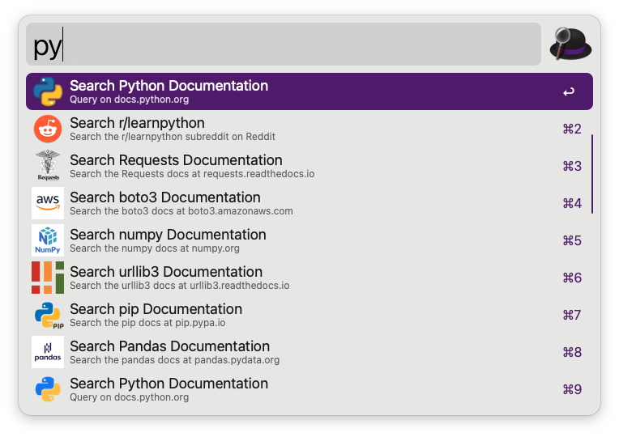
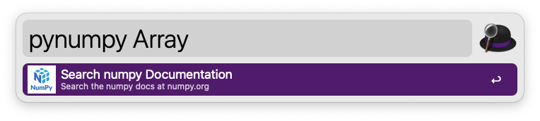

# Python Online Resources Workflow



With this workflow you can:

* **pydoc {query}** - Search Python documentation at docs.python.org
* **pypi {query}** - Lookup a Python package at pypi.org
* **spypi {query}** - Search for packages at pypi.org
* **pyanaconda {query}** - Search Anaconda documentation at docs.anaconda.com
* **pyreddit {query}** - Search the /r/LearnPython subreddit on reddit.com
* **pydjango {query}** - Search Django documenation at docs.djangoproject.com
* **pyflask {query}** - Search Flask documentation at flask.palletsprojects.com
* **pyrequests {query}** - Search Requests documentation at requests.readthedocs.io
* **pyboto3 {query}** - Search boto3 documentation at boto3.amazonaws.com
* **pyurllib3 {query}** - Search Requests documentation at urllib3.readthedocs.io
* **pypandas {query}** - Search pandas documentation at pandas.pydata.org
* **pypip {query}** - Search the pip documentation at pip.pypa.io
* **pynumpy {query}** - Search the numpy documentation at numpy.org


Don't get interrupted and taken out of your (work) flow.  Immediately get the information you need.


No setup, login or configuration.




# Source

The source for this workflow can be found at:
https://github.com/pglombardo/alfred-python-resources

# See Also

* The [Alfred Workflow](https://github.com/pglombardo/pwpush-alfred) for [Password Pusher](https://github.com/pglombardo/PasswordPusher).

## 🛡 License

[](https://github.com/pglombardo/alfred-python-resources/blob/main/LICENSE.md)

This project is licensed under the terms of the `Apache Software License 2.0` license. See [LICENSE](https://github.com/pglombardo/alfred-python-resources/blob/main/LICENSE.md) for more details.


# Author
```
Peter Giacomo Lombardo
https://github.com/pglombardo
https://the0x00.dev
https://pwpush.com
```

